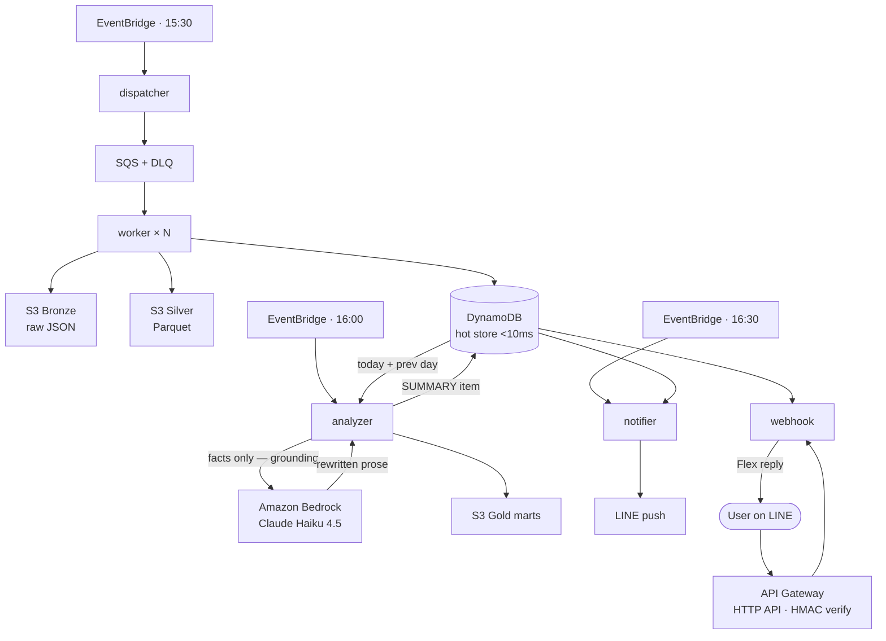
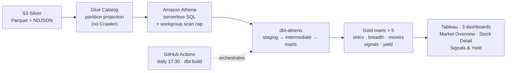

# Taiwan Stock AI Alert System (台股 AI 投資預警系統)

> A production-grade, fully **serverless** AWS side project that runs an end-to-end pipeline every trading day: **market data ingestion → AI-grounded analysis → LINE push notification**, plus an interactive LINE bot and a decoupled BI/analytics layer.
>
> Built as a portfolio piece for **Cloud Solutions Architect** / **Senior Data Engineer** roles. Design north star: **low TCO (all serverless, on-demand) + high automation (IaC + CI/CD, zero standing servers)**.

[]()
[]()
[]()
[-2088FF)]()
[]()
[]()

---

## What it does

Every weekday (Mon–Fri, Taipei time) the system runs itself, with **no human in the loop and no always-on compute**:

| Time (Taipei) | Component | Action |
|---|---|---|
| 15:30 | `dispatcher` | Pull the full TWSE market snapshot, fan each stock out to SQS |
| 15:30+ | `worker` × N | Per-stock ETL → Bronze (raw JSON) + Silver (Parquet) + DynamoDB hot store |
| 16:00 | `analyzer` | Compute deterministic signals in Python, then have Bedrock **rewrite the numbers** into a Traditional-Chinese market summary |
| 16:30 | `notifier` | Push the daily summary to LINE |
| 17:00 | `dividend_ingest` | Ingest dividend-yield & cash-dividend data (decoupled domain) |
| 17:30 | GitHub Actions `dbt build` | Refresh the Athena/dbt Gold marts for BI |

On top of the scheduled pipeline, users **chat with the bot on LINE** to query on demand: `今日` (today's market summary), `訊號` (gainers/losers), `殖利率` (yield ranking), `配息 <code>` (a stock's dividend), and `月配/季配/半年配/年配` (stocks by payout frequency).

---

## Architecture

### Hot path — daily push + interactive query



> **Grounding:** the LLM is handed only the numbers `analyzer` already computed in Python (breadth, top gainers/losers/volume). It rewords — it never sources or invents figures. If Bedrock is unavailable, a deterministic template summary is written instead so the pipeline never breaks.

### Warm path — decoupled BI / analytics (Week 11)



The BI layer is **fully decoupled** from the online hot path (DynamoDB), so heavy analytical scans never touch the low-latency query surface. See [`bi/README.md`](bi/README.md) for connection details and dashboard specs.

---

## Tech stack

| Layer | Choice | Notes |
|---|---|---|
| **IaC** | Terraform | Remote state in S3 + DynamoDB lock; `modules/` + `environments/` split. See [ADR-001](docs/architecture/ADR-001-iac-terraform.md) |
| **CI/CD** | GitHub Actions + **OIDC** | No long-lived AWS keys; workflows for Terraform, image build/push, and dbt |
| **Compute** | AWS Lambda (Docker, **ARM Graviton2**) | 6 functions, one per responsibility |
| **Queue** | Amazon SQS + DLQ | `ReportBatchItemFailures` → per-message retry, not per-batch |
| **Hot store** | DynamoDB (GSI, TTL) | Sub-10ms point reads for the LINE bot |
| **Data lake** | S3 — Bronze / Silver / Gold (medallion) | Raw JSON → Parquet → analytics marts |
| **Analytics engine** | Amazon Athena | Serverless SQL over S3 |
| **Metadata** | AWS Glue Catalog | Partition projection → **no Crawler cost** |
| **Transform** | dbt-athena | staging → intermediate → marts + data tests |
| **BI** | Tableau | ODBC → Athena, Extract-based |
| **AI** | Amazon Bedrock — **Claude Haiku 4.5** | Cross-region inference profile (Tokyo); deterministic fallback if unavailable |
| **Secrets** | AWS SSM Parameter Store / Secrets Manager | No plaintext tokens in env vars |
| **API** | API Gateway (HTTP API) + HMAC | LINE webhook signature verification |
| **Scheduling** | Amazon EventBridge Scheduler | Weekday cron per stage |
| **Monitoring** | CloudWatch alarms + SNS email | Lambda errors + SQS DLQ depth |
| **Interface** | LINE Messaging API | Push + interactive webhook (Flex messages) |

---

## Engineering decisions worth calling out

- **Grounding against hallucination.** The LLM never sees raw market data. `analyzer` computes every number in deterministic Python (breadth, top movers, volume), and Bedrock is given *only those facts* to rewrite into fluent prose. `notifier` quotes the same facts verbatim — the model rewords, it never invents figures.
- **Graceful degradation.** If Bedrock is unavailable, `analyzer` falls back to a deterministic template summary so the pipeline never breaks and `notifier` always has something to push.
- **Decoupling & fault tolerance.** EventBridge → SQS → Lambda → DynamoDB Streams. SQS DLQ + partial-batch failure reporting isolate a single bad stock from the whole run. A non-trading-day guard stops weekends/holidays from writing stale data.
- **Cost discipline (low TCO).** 100% serverless & on-demand. Glue partition projection avoids a Crawler; the Athena workgroup caps scan bytes; dbt runs on GitHub Actions minutes, not standing compute. Estimated run cost **< US$10/month** — see [`docs/COST_ANALYSIS.md`](docs/COST_ANALYSIS.md).
- **Least privilege.** Each Lambda gets its own IAM role scoped to exactly the resources it touches; GitHub deploys via OIDC with no stored credentials.

---

## Repository layout

```
tw_stock_bot/
├── src/                 6 Lambda functions (one dir each; Docker + requirements per fn)
│   ├── dispatcher/        EventBridge → fan out stock list to SQS
│   ├── worker/            SQS → per-stock ETL → Bronze + Silver + DynamoDB
│   ├── analyzer/          Compute signals → Bedrock summary → DynamoDB + S3 Gold
│   ├── notifier/          DynamoDB summary → LINE push
│   ├── webhook/           API Gateway → HMAC verify → DynamoDB → LINE Flex reply
│   └── dividend_ingest/   Dividend-yield & cash-dividend domain (decoupled)
├── infra/               Terraform
│   ├── modules/           lambda · sqs · dynamodb · s3 · ecr · http-api ·
│   │                      eventbridge-schedule · iam-github-oidc · monitoring · analytics
│   └── environments/dev/  Composition + tfvars for the dev environment
├── dbt/                 dbt-athena project (staging / intermediate / marts + tests)
├── bi/                  Tableau workbooks + dashboard screenshots
├── docs/                Architecture (ADR), planning specs, runbook, cost analysis
├── scripts/             One-off operational scripts
├── tests/               (roadmap) unit + integration tests
└── .github/workflows/   terraform.yml · deploy-images.yml · dbt.yml
```

---

## Running it

This is a personal cloud deployment rather than a local app, but the moving parts are reproducible:

```bash
# 1) Infrastructure (from infra/environments/dev)
terraform init && terraform apply

# 2) Build & push Lambda images (or let GitHub Actions deploy-images.yml do it on push)
#    Images are ARM64 Docker, pushed to ECR, then Lambda points at the new digest.

# 3) dbt analytics layer (Windows note: set PYTHONUTF8=1)
cd dbt && dbt deps && dbt build

# 4) Manual backfill / test any stage
#    Invoke a Lambda with {"force": true} to bypass the trading-day guard,
#    or {"trade_date": "YYYY-MM-DD"} to override the target date.
```

---

## Roadmap

**Done**
- [x] Terraform IaC across all resources (modules + dev environment)
- [x] ETL pipeline: dispatcher → SQS → worker (Bronze/Silver/DynamoDB)
- [x] Bedrock-grounded daily analysis + deterministic fallback
- [x] LINE daily push (`notifier`) + interactive bot (`webhook`)
- [x] Dividend-yield & cash-dividend domain (`dividend_ingest`)
- [x] CloudWatch alarms + SNS (Lambda errors, DLQ depth)
- [x] BI/analytics layer: Athena + Glue partition projection + dbt marts + Tableau (Week 11)

**Next**
- [ ] Unit + integration tests (`moto` for AWS mocks) wired into CI
- [ ] RAG news-sentiment enrichment (firecrawl)
- [ ] `staging` / `prod` Terraform environments
- [ ] On-prem GenAI Q&A demo (local LLM over the same marts)

**Later**
- [ ] ML scoring layer to replace rule-based signals
- [ ] Cross-asset extension (US equities / crypto)
- [ ] Multi-region DR

---

## Design principles

1. **Low TCO** — pure serverless + on-demand billing; run cost kept under US$10/month.
2. **Decoupling** — EventBridge → SQS → Lambda → DynamoDB Streams → Lambda.
3. **Fault tolerance** — SQS DLQ, partial-batch failure reporting, data-source strategy, LLM output grounding.
4. **Least privilege** — one IAM role per Lambda; OIDC-based deploys.
5. **Secret hygiene** — SSM / Secrets Manager, never plaintext tokens.
6. **Contract-driven** — explicit schemas between pipeline stages.

---

## License

Private project. All rights reserved.
