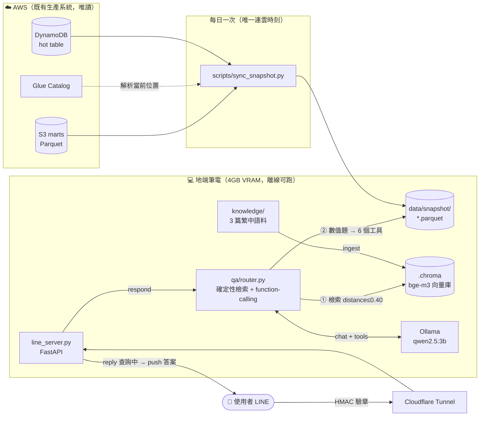

# 地端 LLM 台股 QA（Week 13）

本機執行的地端（on-prem）對話式台股問答，透過 LINE 回答自然語言提問，答案 grounding 在既有台股機器人累積的真實資料。
**不部署上雲、可離線運行、不觸碰生產 bot 資源。** 定位＝面試展示地端 GenAI 能力。

完整設計見 `../docs/planning/week13_local_llm_qa_規劃書.md`。

---

## 進度

- ✅ **階段 0（環境準備）已完成** — 2026-07-06
- ✅ **階段 1（本機資料快照 S3 marts → DuckDB）已完成** — 2026-07-08
  - `scripts/sync_snapshot.py`：以 Glue `get_table` 解析 marts 當前 S3 位置（dbt 每次 build 換 UUID，故不寫死）→ boto3 下載 CTAS 分片 → DuckDB 合併成 `data/snapshot/*.parquet`（5 marts + DynamoDB 匯出 `dividend.parquet`）。
  - `local_llm/tools/snapshot.py`：6 個唯讀 DuckDB 查詢函式（get_stock_ohlcv / get_market_breadth / get_top_movers / get_signals / get_yield_ranking / get_dividend）。
  - **驗收通過**：6 函式回真實資料；2330 OHLCV（close/ma5/ma20）與雲端 Athena 逐列一致。
- ✅ **階段 2（手刻 RAG 靜態知識庫）已完成** — 3 篇繁中語料 → 27 chunks；bge-m3 → Chroma cosine 檢索，無 LangChain。
- ✅ **階段 3（Tool-use 動態查詢）已完成** — 6 個 function schema + Ollama function-calling 迴圈；數字一律來自工具回傳。
- ✅ **階段 4（整合 QA pipeline）已完成** — 來源分級標籤（📅 資料／📚 知識庫＋檔名／ℹ️ 無可靠來源）。
  3B 當 router 不可靠 → 改「確定性檢索注入」（distance ≤ 0.40），只有數值題才交給 function-calling。
- ✅ **階段 5（LINE 整合）已完成並實機驗收通過** — 2026-07-10
  `line_server.py`（FastAPI）：HMAC-SHA256 驗章 → `respond()` → reply「查詢中」+ loading 動畫 → push 答案。
  離線 smoke test 18 項全綠（驗章／路由／非同步交棒／忙碌降級／例外釋鎖／長答案截斷）；
  手機實測三路徑（📚 RAG／📅 資料工具／ℹ️ 界外題）皆正確回覆，生產 channel A 未受影響。
  對外端點＝Cloudflare Quick Tunnel（`cloudflared tunnel --url http://localhost:8000`）。
- ⬜ 階段 6（選）：Breeze2 對照 + benchmark
- ✅ **階段 7（文件 + demo 腳本）已完成** — 2026-07-10
  一鍵啟動、3 分鐘 demo 腳本、架構圖、雲／地 TCO 對照、面試 talking points（見下方各節）。

## 階段 0 驗收結果（本機實測）

| 項目 | 結果 |
|------|------|
| Ollama | v0.31.1（`winget install Ollama.Ollama`），server `http://localhost:11434` OK |
| 主力模型 | `qwen2.5:3b`（1.9GB），**熱狀態 ≈ 52 tok/s**，繁中生成正常 |
| Embedding | `bge-m3`（1.2GB），維度 **1024** |
| **VRAM（RTX 3050 Ti 4GB）** | qwen 2.2GB + bge-m3 0.66GB＝**約 2.9GB，兩者可同時常駐 GPU（100% GPU）** |
| 結論 | 3B + embedding 在 4GB VRAM 共存無虞；52 tok/s 對 LINE 即時回覆充足 |

> 編碼雷：Windows/Git Bash 用 curl 直送中文 JSON 會亂碼 → 一律用 Python `json.dumps`（ASCII escape）或 `PYTHONUTF8=1`。

## 環境變數（demo 用，勿寫明文入庫）

```
setx LINE_DEMO_CHANNEL_TOKEN  "<demo channel access token>"
setx LINE_DEMO_CHANNEL_SECRET "<demo channel secret>"
```
（AWS 憑證沿用本機既有 profile；`MARTS_BUCKET` 預設已指向現有 marts bucket。）

## 目錄

```
local_llm/
├─ config.py            # 全域設定（路徑/模型/端點/秘密讀環境變數）
├─ requirements.txt     # 相依套件
├─ knowledge/           # RAG 語料（階段 2 撰寫）
├─ rag/                 # ingest.py / retrieve.py（階段 2）
├─ tools/               # snapshot.py / schemas.py（階段 1、3）
├─ qa/                  # router.py / prompts.py / llm.py（階段 3、4）
├─ line_server.py       # FastAPI webhook（階段 5）
└─ eval/                # benchmark.py（階段 6）
```

## 階段 5：LINE 整合設定步驟

> 🔴 **必用獨立的第二個 channel（demo channel B）。** 生產 bot 的 channel A webhook 指向 Lambda Function URL；
> 若把 channel A 的 Webhook URL 改指本機，線上 bot 立刻癱瘓。

### 1. 建立 demo channel（LINE Developers Console）
新建一個 Messaging API channel（Demo 專用 OA）→ 取得 **Channel secret** 與 **Channel access token（long-lived）**。
於 Messaging API 頁籤關閉「自動回應訊息」、開啟「Webhook」。

### 2. 設環境變數（不寫明文入庫）
```
setx LINE_DEMO_CHANNEL_TOKEN  "<demo channel access token>"
setx LINE_DEMO_CHANNEL_SECRET "<demo channel secret>"
```
`setx` 只影響**新開的**終端機，設完請重開 shell。確認：`curl http://localhost:8000/healthz` 應回 `credentials_loaded: true`。

### 3. 起服務
```
ollama serve                                   # 若尚未常駐
python scripts/sync_snapshot.py                # demo 前更新快照（唯一連雲時刻）
uvicorn local_llm.line_server:app --port 8000  # Windows 需 PYTHONUTF8=1
```

### 4. 對外端點（Cloudflare Tunnel，named tunnel＝固定網址）
```
cloudflared tunnel login
cloudflared tunnel create stock-qa-demo
cloudflared tunnel route dns stock-qa-demo stock-qa.<你的網域>
cloudflared tunnel run --url http://localhost:8000 stock-qa-demo
```
固定 hostname 的好處：重開不換網址，免每次回 LINE console 改 Webhook URL。
（無自有網域時可用 ngrok 臨時測試，但免費版網址每次變動。）

### 5. 驗收
1. LINE console 填 Webhook URL＝`https://stock-qa.<你的網域>/callback` → 按 **Verify** 應成功（events 為空、驗章通過即回 200）。
2. 手機加 demo OA 好友 → 傳「今日」「台積電走勢」「什麼是殖利率」→ 皆正確回覆。
3. 慢查詢應看到「🔎 查詢中…」+ 輸入中動畫，答案隨後由 push 補送，**不逾時**。
4. 確認生產 channel A 完全未動（線上 bot 仍正常）。

### 設計要點（面試可講）
| 決策 | 理由 |
|------|------|
| reply token 只回「查詢中」，答案走 push | reply token 時效遠短於 3B + tool-use 的來回時間 |
| 單機 single-flight lock，忙碌直接降級 | 4GB VRAM 跑不動並行推論；排隊只會換成逾時 |
| 收到請求先回 200，QA 丟背景 | LINE webhook 逾時會重送 → 造成重複推論 |
| 驗章沿用生產 webhook 寫法 | HMAC-SHA256 → base64 → `compare_digest`（常數時間比對，防 timing attack） |

---

## 架構



**離線邊界**：`sync_snapshot.py` 跑完之後，除了 LINE 訊息本身要走網路，**整條 QA 鏈路（檢索、推論、查數）都在本機**，不呼叫任何雲端 API、不產生任何 token 費用。

---

## 一鍵啟動（demo 前置）

Windows PowerShell，四個步驟。Ollama 為開機常駐服務，通常不需手動啟動（確認用 `curl http://localhost:11434/api/tags`）。

```powershell
cd C:\Users\wendytsai\Documents\wd_agent\tw_stock_bot
$env:PYTHONUTF8 = "1"

# 1. 更新快照（唯一連雲時刻，需本機 AWS 憑證；跑完即可離線）
.venv\Scripts\python.exe scripts\sync_snapshot.py

# 2. 預熱模型（避免 demo 第一題等首次載入）
.venv\Scripts\python.exe -m local_llm.qa.router "台積電走勢"

# 3. 起 webhook（保持開啟）
.venv\Scripts\uvicorn.exe local_llm.line_server:app --port 8000

# 4. 另開視窗起 tunnel（保持開啟），把網址填回 LINE console 的 Webhook URL
cloudflared tunnel --url http://localhost:8000
```

檢查點：`http://localhost:8000/healthz` 應回 `{"ok": true, "credentials_loaded": true, "busy": false}`。

> **筆電注意**：demo 前插電並預熱模型（步驟 2）。GPU 冷啟動第一題會慢好幾秒，熱起來之後 ≈ 52 tok/s。

---

## 3 分鐘 demo 腳本

三題各打中一條不同的路徑，順序刻意安排成「資料 → 知識 → 誠實拒答」。

| 時間 | 問題 | 展示什麼 | 你要說的話 |
|------|------|---------|-----------|
| 0:00–0:20 | *（開場）* | 定位 | 「這是完全跑在這台筆電上的台股問答，除了 LINE 訊息本身，沒有任何一個 byte 送到雲端。模型是 Qwen2.5-3B，跑在 4GB VRAM 上。」 |
| 0:20–1:00 | **台積電走勢** | **Tool-use，數字零杜撰** | 「模型自己決定要呼叫 `get_stock_ohlcv(2330)`，去查本機的 DuckDB 快照。這些數字不是它生出來的，是查出來的——所以末尾標了 📅 資料日期。」 |
| 1:00–1:40 | **什麼是殖利率** | **RAG，答案帶出處** | 「這題沒有數字，走的是向量檢索。注意末尾標了 📚 和**檔名**——答案可以被追溯到知識庫的哪一篇。」 |
| 1:40–2:20 | **比特幣會漲嗎** | **誠實降級（最重要）** | 「這題超出資料範圍。它沒有假裝知道——標了 ℹ️『未引用本地資料，請自行查證』。金融場景裡，**知道自己不知道** 比答對更值錢。」 |
| 2:20–3:00 | *（收尾）* | 雲／地對照 | 「同一套 QA 能力我做了兩版：雲端走 Bedrock + Lambda，地端走 Ollama。差別不在誰比較厲害，在資料主權跟成本結構——我可以講清楚什麼時候該選哪一個。」 |

**備援**：若 tunnel 或手機出狀況，直接在終端機跑 CLI 版，不影響敘事：

```powershell
.venv\Scripts\python.exe -m local_llm.qa.router "台積電走勢"
```

---

## 雲端 vs 地端 TCO 對照

同一套 QA 能力的兩種實作。雲端版數字來自 `../docs/COST_ANALYSIS.md`（bottom-up 估算）。

| 項目 | ☁️ 雲端版（Bedrock + Lambda） | 💻 地端版（Ollama + DuckDB） |
|------|------------------------------|----------------------------|
| 推論成本 | 依 token 計價（Claude Haiku 4.5：**$1 / $5 per MTok** in/out） | **$0**（僅電費） |
| 每月推論費 | ≈ $0.10（每日 1 次摘要，21 次/月） | ≈ **$0.6**（電費，見下方假設） |
| 固定成本 | $0（無閒置資源） | 硬體攤提（此處為既有筆電＝沉沒成本） |
| 儲存／查詢 | S3 + Athena + DynamoDB ≈ $0.4 | 本機檔案 $0 |
| 可用性 | 24×7、多 AZ、自動擴容 | 筆電開機才在（demo 定位，不追高可用） |
| 資料主權 | 資料離開機房 | **資料完全不出本機** |
| 維運複雜度 | 低（全 serverless、IaC 管理） | 中（要顧模型、驅動、tunnel） |
| 冷啟動 | Lambda 冷啟數百 ms | GPU 首次載入數秒 |

**電費假設**：推論時整機 ≈ 90W，demo 用量 2 小時/日 → 5.4 kWh/月；台電住宅電價約 NT$3.5/kWh ≈ NT$19/月 ≈ **US$0.6**。

### 交叉點在哪裡（面試最愛問的）

真正的問題不是「誰比較便宜」，而是**在什麼用量下地端才划算**。

- 雲端每題成本：假設 2,000 input + 500 output tokens → `2000/1M × $1 + 500/1M × $5` ≈ **$0.0045/題**
- 地端每題邊際成本：電費，≈ $0.00003/題（趨近於零）
- 但地端有固定成本：若需採購一台專用 GPU 機（NT$40,000 / 3 年攤提）≈ **US$36/月**

→ 交叉點 ≈ `$36 ÷ $0.0045` ≈ **每月 8,000 題（約每日 270 題）**。

**結論**：低流量時雲端完勝（我這個 side project 就是這種）；但一旦流量穩定在每日數百題以上，或**資料根本不允許離開機房**，地端的固定成本就被攤平了。台灣多數企業選地端，主因往往不是第二個條件之外的成本——是第一個。

> ⚠️ 上表為**工程估算**，非實際帳單。Bedrock 上的 Claude 定價由 AWS 自行公告，可能與 Anthropic API 的 list price 不同；正式引用前請以 AWS 定價頁為準。

---

## 面試 talking points

按「他們會問什麼」排序，每點都有具體證據可指。

**1. 為什麼不用 LangChain？**
> RAG 這條鏈路只有三步：切段、embed、檢索。手刻大約 100 行，我完全知道每個 chunk 怎麼切、distance 門檻怎麼定。用框架我會多背一層抽象，出事時反而難 debug。這不是反框架，是這個規模不需要。

**2. 3B 模型怎麼防幻覺？**（**最強的一題**）
> 三層。第一，數字**只能**來自工具回傳，system prompt 明令禁止生成數字。第二，我原本讓模型自己決定要不要查知識庫，實測 5 題有 3 題它憑記憶答、不叫檢索——所以我改成**確定性檢索注入**：每題都先檢索，distance ≤ 0.40 就把片段塞進 context。不讓 3B 決定「要不要查」，只讓它決定「怎麼答」。第三，每則答案標來源等級：📅 來自資料、📚 來自知識庫（含檔名）、ℹ️ 無可靠來源。
>
> 驗收時有一題問比特幣，模型答錯了細節，但它**誠實貼上了 ℹ️ 標籤**。那一刻反而證明了標籤的價值。

**3. 為什麼 LINE 要用 push 而不是 reply？**
> reply token 的時效遠短於 3B 做 tool-use 的來回時間。所以 reply token 只用來回「查詢中」，真答案走 push API。另外 4GB VRAM 跑不動並行推論，我加了 single-flight lock——第二個請求直接回「請稍候」，而不是排隊等到逾時。排隊只是把「忙碌」換成「逾時」，體驗更差。

**4. 你怎麼確定地端算出來的數字是對的？**
> 階段 1 驗收時，我拿 2330 的 OHLCV 對雲端 Athena 逐列比對，close / ma5 / ma20 完全一致。快照的來源就是同一批 dbt marts，所以雲、地兩版**資料同源**——差別只在算力在哪裡。

**5. 這個和你的雲端 bot 是什麼關係？**
> 完全獨立、互不干擾。生產 bot 的 webhook 掛在 Lambda Function URL，地端用的是**另一個 LINE channel**。地端只唯讀既有的 marts，不寫任何雲端資源。兩者資料同源、能力對照，構成「同一 QA 能力，雲/地兩套，我能講清取捨」的完整敘事。

**6. 為什麼要做地端？雲端不是更省？**
> 在我這個流量下，雲端確實更省——每月不到一美元。但成本不是唯一的決策變數。台灣很多企業的資料不能離開機房，這時候討論的不是省多少，而是**能不能做**。我做這個是為了證明兩件事：一，我知道交叉點大概在每日 270 題；二，真要落地地端，我已經踩過 VRAM、量化、function-calling 可靠度這些坑。

---

## 下一步（階段 6，選配：Breeze2 對照 benchmark）

1. `ollama create` 匯入 Breeze2-3B。
2. `eval/benchmark.py`：同一批問題跑 Qwen vs Breeze2，記錄繁中品質（人工評分）、tool-use 成功率、延遲（tok/s）。
3. 產出比較表寫進本節，當作「我做過模型選型，不是隨手抓一個」的證據。

> 每次 demo 前先跑 `python scripts/sync_snapshot.py` 更新快照（需本機 AWS 憑證；跑完即可離線）。
